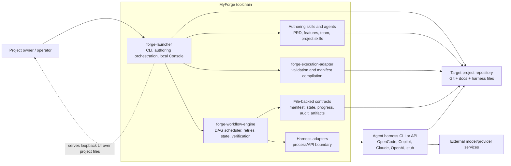
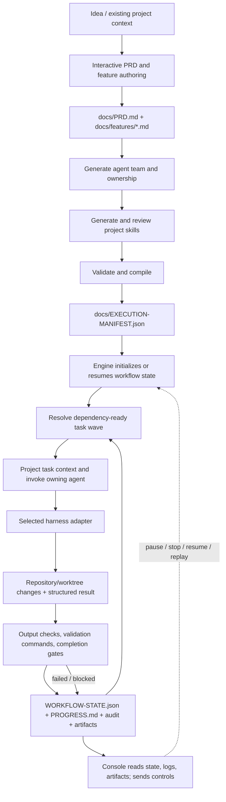

# Project Architecture Blueprint

**Generated:** 2026-10-06  
**Scope:** MyForge repository architecture as implemented on this date  
**Detection:** Node.js / TypeScript toolchain; modular, file-oriented orchestration system  
**Detail level:** Comprehensive, with implementation examples and decision records

This document is a codebase-grounded companion to [ARCHITECTURE.md](ARCHITECTURE.md), not a replacement for package READMEs, operational guides, or accepted ADRs. It describes current active paths and marks historical or unverified behavior explicitly. Package and file references below are implementation evidence; the architecture can evolve after this snapshot.

## 1. Detection and Architectural Overview

### Technology profile

- **Runtime and packages:** Node.js 18+ with independently packaged npm tools. CI currently validates the launcher, execution adapter, workflow engine, and skill-review package on Node.js 22 for Linux and Windows.
- **Primary implementation language:** TypeScript, compiled with `tsc`; the Console client is also TypeScript and has a separate TypeScript build configuration. Small scripts use JavaScript modules, Bash, and PowerShell.
- **User interface:** terminal CLI/TUI plus a local browser Console served by the launcher. The Console embeds the PixiJS Forge Board; it is not a React or Angular application.
- **Authoring/configuration:** Markdown skills, agents, PRD and feature documents; JSON manifests, configuration, workflow state, and artifacts; JSON Lines audit records.
- **Infrastructure:** Git and external agent/model CLIs or APIs. The core workflow does not require a hosted application server, relational database, service mesh, or cloud deployment.

The repository is best characterized as a **modular monolith/toolchain**, not as deployed microservices. Its package boundaries are separated by responsibility and process lifecycle, but the packages are distributed and bootstrapped into a target repository rather than deployed as network services. The active architecture combines:

1. Interactive, human-reviewed requirements authoring.
2. Headless mechanical derivation of agent teams and project skills.
3. A compiler boundary that turns requirements and team metadata into an execution manifest.
4. A detached, resumable workflow process that schedules manifest tasks through replaceable harness adapters.
5. File-backed state, artifacts, and audit records, projected by a local Console.

The most important dependency rule is temporal as well as structural: **the engine consumes the compiled manifest, not the PRD**. Changes to source requirements require a re-derivation/recompile before execution. Requirements authoring is deliberately interactive; later derivation and execution can be automated once the requirements have been reviewed (see [ADR-060](docs/adr/060-interactive-requirements-authoring.md)).

### C4-style context and container view



This diagram shows logical ownership, not separate deployed services. The launcher, compiler, and engine are Node processes/packages with distinct entry points; the Console server is a launcher capability. A harness may itself invoke a hosted provider, but MyForge does not own that provider boundary.

### Execution and data flow



## 2. Core Components and Boundaries

| Component | Responsibility and internal structure | Interfaces, evolution, and limits |
|---|---|---|
| **Launcher** (`scripts/forge-launcher/`) | Cross-platform npm CLI for project selection/creation, bootstrap, authoring handoffs, resume, engine invocation, and Console startup. The Console server and browser client are implemented within this package. | Owns lifecycle and subprocess coordination, not PRD semantics or task scheduling. Harness discovery/selection, command construction, and package resources are extension points. Shell wrappers delegate to the Node launcher. Current package metadata requires Node 18+. |
| **Authoring skills and agents** (`templates/skills/`, `templates/agents/`) | Reusable prompt/workflow instructions bootstrapped into a target harness. Requirements authoring is conversational; team and skill derivation operate on reviewed source documents. Team and skill review gates check generated content. | Markdown contracts and harness conventions are the principal interfaces. Do not confuse derived agent/skill documents with the engine's task runtime. Skill packages vary: some include TypeScript tooling, others are instruction-only. |
| **Execution adapter** (`templates/skills/forge-execution-adapter/`) | Discovers the project/harness inputs, validates PRD and feature structure, compiles agents/tasks/dependencies and metadata into `docs/EXECUTION-MANIFEST.json`. | The manifest is the stable compiler/runtime contract. The adapter is a compile-time boundary: it does not schedule tasks, run harnesses, or own runtime retries. Feature-based source layout is the current engine contract. |
| **Workflow engine** (`templates/skills/forge-workflow-engine/`) | CLI, manifest reader, DAG readiness and wave scheduling, task execution, retry/timeout/cancellation/replay policy, verification gates, and state updates. Internal modules separate engine coordination, state, task graph, artifacts, and harness implementations. | Consumes a compiled manifest and invokes a harness adapter interface. It owns execution policy; adapters return results rather than mutating engine state. Parallel work uses isolated Git worktrees and requires a clean tree and concurrency-capable harness. |
| **Harness adapters** (`.../scripts/harness/`) | Translate task requests to supported runner CLIs or APIs (including OpenCode, Copilot, Claude, OpenAI, and stub paths as currently documented). | Adapter selection is configurable. New backends should implement the existing invocation/result contract and declare concurrency support only when it is actually safe. Retired workforce/kernel integration is not an active backend. |
| **File-backed run records** | Engine state and human progress live in `docs/WORKFLOW-STATE.json` and `docs/PROGRESS.md`; append-only events in `docs/EXECUTION-AUDIT.jsonl`; task requests/results and typed artifacts under `docs/artifacts/`. | Plain files support inspection, diffing, resume, and replay without a database service. Their schemas are contracts and should change compatibly. Generated run records may contain sensitive prompts/output; their retention and repository treatment must be deliberate. |
| **Forge Console** (`scripts/forge-launcher/scripts/console/`) | Local browser projection of project registry, workflow state, audit, logs, documents, artifacts, team, and tasks; offers authoring handoffs and run controls by supervising launcher/engine processes. Includes the Forge Board view. | Loopback-only local HTTP UI, not a hosted control plane. It reads and writes the same files as CLI tools and does not reimplement execution. Mutating requests use a per-server token; this is a local request guard, not account authentication. |
| **Bootstrap and repository scripts** (`scripts/`) | Bash/PowerShell entry wrappers and resource-copy/bootstrap operations for target repositories. | Thin compatibility/OS integration boundary around the npm launcher and template resources. Keep shell-specific behavior out of the TypeScript domain logic where possible. |

## 3. Layers, Dependency Rules, and Communication

The active flow is a pipeline of ownership boundaries, not a strict Clean Architecture implementation:

1. **Authoring layer:** prompts and skills produce reviewed requirement and team documents. Human approval is part of the requirement boundary.
2. **Compilation layer:** the execution adapter reads those source documents and emits the neutral manifest. It must not become a second requirements author or runtime scheduler.
3. **Orchestration layer:** the engine interprets the manifest, coordinates task attempts and gate results, and delegates runner-specific work.
4. **Infrastructure boundaries:** filesystem state/artifact stores, process management, Git worktrees, and harness adapters isolate environmental effects.
5. **Projection/control layer:** Console reads shared records and routes supported user actions to launcher/engine operations.

Dependency direction in the execution path is `manifest -> engine policy -> adapter interface -> external runner`; state and artifact modules serve the engine. The adapter compiles inputs into the manifest and is not called by the engine to reread the PRD. Launcher coordinates the packages as processes and copies resources; packages are not one shared runtime object graph with a dependency-injection container.

No dedicated repository-wide static architecture rule or package-cycle checker is documented. Package-level TypeScript checks and tests provide local validation, but they do not prove the absence of every cross-layer violation or circular dependency. Keep imports within each package and use manifest, CLI, and file contracts between bootstrapped packages.

### Communication patterns

- **Launcher to package:** child-process invocation with explicit arguments, working directory, environment, and captured/logged output.
- **Engine to harness:** typed task request and result across the adapter interface; concrete adapters use child processes or provider APIs.
- **Console browser to Console server:** local HTTP/JSON API; mutating requests carry a server token. No public remote service-discovery mechanism is present.
- **Console to CLI/engine:** supervised local child processes and shared project files. The Console is not an alternate execution engine.
- **Task-to-task context:** optional typed artifact inputs/outputs and compact context projection, rather than passing the full workflow history to each agent.
- **Asynchronous execution:** detached jobs and engine process lifecycle; durable state permits resume. There is no general-purpose message broker or event bus in the active system. JSONL audit is a persisted event stream, not a pub/sub transport.

There is no general API versioning or service discovery strategy because the active internal contracts are package CLIs and versioned/validated files, not a fleet of network services. Changes to the manifest, state, Console API, or launcher flags should nevertheless be treated as compatibility-sensitive.

## 4. Data Architecture

The domain is represented primarily by documents and execution records, not ORM entities or a relational aggregate model.

| Record | Role | Ownership and lifecycle |
|---|---|---|
| `docs/PRD.md`, `docs/features/*.md` | Reviewed product vision, feature boundaries, acceptance intent | Authored interactively; canonical requirements contract. |
| Agent and skill files in the selected harness root | Task ownership/personas and reusable project instructions | Derived from reviewed requirements, then reviewable and editable. |
| `docs/EXECUTION-MANIFEST.json` | Compiled phases, tasks, dependencies, expected outputs, validation and optional artifact contracts | Produced by the execution adapter; consumed by engine. Recompile after requirement/team changes. |
| `docs/WORKFLOW-STATE.json` | Mutable current run/task status, selection, timestamps, attempts, and references | Engine-owned snapshot used for resume/control. |
| `docs/PROGRESS.md` | Human-readable progress projection | Synchronized from runtime state; do not treat as an independent scheduler database. |
| `docs/EXECUTION-AUDIT.jsonl` | Append-only task/run/context/artifact events | Diagnostic and audit trail; append rather than rewriting history. |
| `docs/artifacts/` | Typed decision, work, and evidence artifacts | FileArtifactStore; task IDs and artifact inputs establish provenance links. |
| Task execution files | Current task prompt/result plus immutable timestamped attempt results | Local operational diagnostics; contain potentially sensitive content and need retention controls. |
| Console project registry and job records | Local project selection and detached job history | User-level local configuration, honoring Forge/XDG home configuration. Not project domain data. |

The artifact store is file-based and exposes a typed boundary intended to permit alternate storage implementations later. Current artifact types are dot-separated; type suffix determines a subdirectory. Consumers request artifact types, and the engine resolves completed artifacts and projects selected fields into task context. The source artifact remains the provenance record; projected context is a compact handoff, not a mutable shared domain object. See [artifact-store deep dive](docs/artifact-store-deep-dive.md) and [ADR-017](docs/adr/017-artifact-store-and-context-projection.md).

There is no general cache, ORM, database migration system, or entity relationship mapping layer in the active architecture. In-memory ID reservation and task/run state serve narrow runtime purposes; do not describe these as a general cache. Validation is distributed: PRD/feature validation and compiler checks before manifest production, manifest/schema and ownership checks at compile/run boundaries, and output/report/command gates during task execution.

## 5. Cross-Cutting Concerns

### Security and access control

- The Console binds to loopback and uses a per-server token for mutating requests. This constrains local browser/API access but does not provide identity, roles, remote authentication, or authorization between named users.
- Harness CLIs and provider APIs are external trust boundaries. Credentials are expected to follow those tools' environment/configuration conventions; MyForge does not provide a universal secret vault.
- Parallel execution uses Git worktrees to isolate task changes and requires a clean working tree. It is execution isolation, not an OS security sandbox.
- Logs, prompts, results, artifacts, and audit records can expose project or model content. Keep generated diagnostics local as intended, review Git ignore/commit policy, and define retention for downstream projects.
- File access and process invocation should continue to validate repository-relative paths and avoid treating untrusted manifest strings as shell fragments.

### Errors, retries, and resilience

- Engine task outcomes distinguish failure categories such as retryable, configuration, exception, timeout, and cancellation. Retry policy applies to eligible failures; configuration/exception/cancellation are terminal rather than blindly repeated.
- Each attempt records results and gate outcomes; retry context can include a bounded failure reason and prior result reference. Structured completion reports separate blocking unresolved requirements from warnings/limitations.
- State persistence, progress projection, audit events, pause/stop, replay, and resume make long builds inspectable and recoverable. A graceful stop allows in-flight work to finish; immediate abort is a separate boundary.
- External process/API errors remain adapter concerns and must be translated into task results with correct failure classification. Process cleanup and Windows/POSIX behavior require platform-specific tests.
- There is no generic circuit breaker framework or universal fallback policy. Stub mode is a testing/dry-run path, not an automatic production fallback.

### Logging and monitoring

- Launcher/Console jobs and engine output are captured in local logs (commonly `docs/engine-run.log`). The engine emits progress/heartbeat output for long invocations.
- `WORKFLOW-STATE.json` is the current-state view; `PROGRESS.md` is its human-readable projection; `EXECUTION-AUDIT.jsonl` records append-only events. Artifact and attempt files provide task-level evidence.
- Console views project tasks, logs, audit events, and artifacts; they do not constitute centralized telemetry or external alerting.
- No hosted metrics/tracing backend or general performance-monitoring service is evident in the active deployment.

### Validation and configuration

- Requirement correctness is protected by interactive authoring and human review; downstream gates cannot infer whether the product intent itself is correct.
- Compiler validation checks source layout and manifest construction. Engine checks task ownership, dependencies, output expectations, structured completion handoff, and required validation commands as applicable.
- Configuration is supplied through CLI options, environment variables, project-local files, manifest metadata, and harness configuration. Console has local authoring/model settings; provider secrets remain outside a universal MyForge-managed store.
- Feature flags are not a general cross-package mechanism. Avoid adding ad hoc toggles where a CLI/config contract is more appropriate.

## 6. Technology-Specific Patterns

### Node.js and TypeScript

- Each primary package has its own `package.json`, TypeScript configuration, scripts, and tests. ES modules use package-level `"type": "module"` and compiled TypeScript entry points.
- Runtime dependencies are intentionally small and package-local. The launcher owns cross-platform CLI orchestration and Console hosting; the engine owns scheduling/state; the adapter owns validation/compilation.
- The launcher compiles server/client TypeScript and stages template/resource assets for npm distribution. Bootstrapped skill packages install their own dependencies in target repositories.
- Tests use Node's built-in test runner, often with `tsx` for TypeScript. Validation includes typechecking and package-specific tests.
- Do not impose React/Angular conventions or a container/middleware architecture on the Console: it is a TypeScript local server and client without a frontend framework or bundler.

### CLI and process architecture

The launcher normalizes user input and platform details, then invokes bootstrap, skills, compiler, or engine commands. Process boundaries are intentionally visible: authoring may require an interactive terminal; derivation can run as a detached job; the workflow engine is a standalone resumable process. Preserve OS-specific process cleanup, executable discovery, quoting, signals, and path behavior when modifying this layer.

### Historical technology paths

The workforce compiler and FlowForge kernel integration are retired. Current supported execution proceeds through `forge-execution-adapter` and native workflow-engine harness adapters. Historical designs remain in ADRs and retirement notes but are not new-development instructions; see [the retirement note](docs/workforce-compiler-deep-dive.md).

## 7. Implementation Patterns and Examples

### Contract-first compilation and execution

The compiler produces an explicit manifest; the engine rejects legacy source layouts rather than silently guessing. In a target repository, the conceptual commands are:

```sh
npm run forge-execution-adapter -- compile
npm run workflow-engine -- run --harness opencode --yes
```

Use the package's documented CLI and selected harness configuration; flags can evolve. The key invariant is that compilation completes before execution and the engine's source of truth is the resulting manifest.

### Adapter boundary

The harness adapter accepts a task request and returns a result. Keep retry, state mutation, audit, and completion policy in the engine; keep provider/process details in the adapter. A new adapter should not write `WORKFLOW-STATE.json` directly. Concurrency capability must be declared only if concurrent invocations and isolated outputs are supported.

### File-backed artifact contract

Tasks can declare artifact types they consume and optionally produce. The engine loads completed artifacts, creates a compact context projection, then synthesizes/persists the resulting artifact with task provenance and evidence. Preserve the additive behavior for tasks without artifact declarations and do not invent confidence or successful validation evidence.

### Console API and controls

The browser client calls typed JSON endpoints. The server validates requests, checks the per-server token for mutations, and delegates to launcher/engine operations. New UI functionality should use the existing API/control path and shared project records, not create a second task scheduler or divergent state store.

## 8. Testing Architecture

- **Unit/package tests:** Node test runner with TypeScript execution, package-local tests for launcher, adapter, and engine; tests exercise parser/compiler, process arguments, state transitions, retries, artifacts, Console endpoints, and OS-sensitive lifecycle behavior.
- **Contract checks:** typecheck each package; PRD/manifest/team validation; launcher build and version-consistency check.
- **Cross-platform CI:** `.github/workflows/validation.yml` runs package checks on `ubuntu-latest` and `windows-latest`, using Node 22. The workflow has bounded job timeouts.
- **Smoke/integration checks:** launcher bootstrap, Console startup, and stub/dry-run engine paths provide progressively broader validation. External model/harness credentials are not required for all tests.
- **Test doubles:** stub harness and controlled child-process/filesystem fixtures are preferred for deterministic tests. Keep native/external harness assumptions out of core logic tests.

For package commands and the current suite inventory, see [docs/testing-guide.md](docs/testing-guide.md). A change to one package should run that package's tests and typecheck; process lifecycle, shared file contracts, or cross-platform behavior warrants the relevant integration and Windows/Linux checks.

## 9. Deployment and Runtime Topology

MyForge is primarily installed and run locally. `forge-launcher` is packaged as an npm CLI; bootstrap copies agent/skill resources into a Git repository. The execution adapter and workflow engine are installed/run from the target repository. The Console starts a local loopback HTTP server and opens a browser. The engine and Console may supervise local child processes and write project-local files.

No Docker/Kubernetes topology, cloud-hosted MyForge control plane, service discovery, or mandatory database is established by the current configuration. A chosen harness may communicate with external model services, but those are provider dependencies, not MyForge services. Environment-specific differences chiefly concern OS process handling, paths, terminals, Git, harness installation, and user-level configuration directories.

Supported operational prerequisites and package setup are documented in [testing guide](docs/testing-guide.md), [launcher guide](docs/forge-launcher.md), and [Console guide](docs/forge-console.md). Do not infer a production deployment SLA or remote security model from local Console operation.

## 10. Architectural Decisions and Tradeoffs

| Decision | Context and current consequence | Record |
|---|---|---|
| Interactive requirement authoring, automated derivation | Prevents downstream automation from confidently implementing an unreviewed/incorrect specification. Team, skills, compilation, and execution remain automatable after the requirement gate. | [ADR-060](docs/adr/060-interactive-requirements-authoring.md) |
| Launcher as a cross-platform npm package | Provides one guided lifecycle and Console entry point; current implementation supersedes the original shell-only launcher choice. Shell/PowerShell wrappers remain thin delegates. | [ADR-010](docs/adr/010-forge-launcher.md) notes supersession; see ADR-023 for the package decision. |
| Neutral execution manifest between authoring and runtime | Avoids making the runtime scrape prompts/PRD and lets the engine run independently of authoring. Compiler scope and feature-based contract have evolved since the original ADR. | [ADR-011](docs/adr/011-forge-execution-adapter.md) |
| Detached engine and native harness adapters | Separates long-running execution from chat/session lifetime and makes the run resumable as a standalone process. | [ADR-019](docs/adr/019-authoring-execution-split-and-copilot-harness.md) |
| File artifact store and context projection | Keeps outputs inspectable and reduces irrelevant context passed between tasks, at the cost of file growth and explicit retention responsibility. | [ADR-017](docs/adr/017-artifact-store-and-context-projection.md) |
| Parallel tasks use isolated worktrees | Prevents sibling task changes from contaminating output attribution; requires clean working tree and harness concurrency support. | [ADR-056](docs/adr/056-parallel-execution-task-sandboxes.md) |
| Workforce/kernel integration retired | The supported path is adapter compilation followed by the workflow engine; historical `.workforce` and kernel records are not active integration instructions. | [ADR-038](docs/adr/038-flowforge-retirement.md) and [retirement note](docs/workforce-compiler-deep-dive.md) |

These records provide rationale and consequences. Do not infer alternatives or tradeoffs not stated in an ADR; older ADRs can be superseded by newer decisions while remaining historical records.

## 11. Architecture Governance

- **Requirements authority:** `docs/PRD.md` plus `docs/features/*.md` is the active product contract; generated execution manifests are snapshots. See [canonical features](docs/canonical-features.md).
- **Package ownership:** launcher, adapter, engine, and skill packages have local scripts, typechecks, and tests. Avoid cross-package runtime imports; use documented CLI/file contracts.
- **Automated gates:** CI validates selected packages on Linux and Windows, runs typechecks/tests, validates agent-team gates, builds the launcher, and checks version consistency. These gates do not replace architectural review.
- **Decision records:** significant architectural changes receive a new numbered ADR; preserve history and mark supersession/retirement rather than rewriting prior decisions.
- **Documentation:** the documentation map identifies authoritative guides and update triggers. Update affected package skills, operational guides, deep dives, ADRs, and changelog when behavior changes.
- **Compliance limits:** no general architecture fitness test, import-layer rule, or automatic dependency-cycle gate is documented. A change affecting boundaries should include focused tests and an explicit architecture/doc review.

## 12. Blueprint for New Development

### Workflow

1. Identify whether the change belongs to authoring/templates, compilation, execution, launcher/process coordination, or Console projection. Keep ownership at the narrowest responsible package.
2. For a new user-facing capability, establish the requirements and public CLI/file/API contract before wiring it across packages.
3. Keep authoring, compilation, and execution distinct. Requirements-changing operations must retain interactive review; mechanical derivation should be reproducible; engine work should consume the compiled contract.
4. Add or evolve typed contracts in the owning package. Consider compatibility for manifests and persisted state already present in user repositories.
5. Implement side effects behind existing boundaries: harness calls behind adapters, persistence behind state/artifact modules, and process orchestration behind launcher utilities.
6. Add focused tests at the package boundary; include filesystem/process fixtures and OS coverage where relevant. Run package typecheck and tests, then required cross-package checks.
7. Update the source-of-truth docs and decision records identified by [docs/documentation-map.md](docs/documentation-map.md). Check examples and links against current commands.

### Placement guide

- New launcher command or lifecycle operation: `scripts/forge-launcher/scripts/` and its launcher tests/docs.
- Console endpoint or view: `scripts/forge-launcher/scripts/console/`; keep API types, server validation, client call, and UI behavior aligned.
- Manifest input, validation, or output contract: `templates/skills/forge-execution-adapter/`; update types, compiler tests, skill docs, and compatibility handling.
- Scheduling, retry, state, task gates, artifacts, or harness invocation: `templates/skills/forge-workflow-engine/`; preserve module ownership and add engine tests.
- Reusable instruction/agent behavior: `templates/skills/` or `templates/agents/`, not launcher runtime code unless orchestration is required.
- Shell or platform bootstrap integration: `scripts/*.sh` / `scripts/*.ps1`; keep wrappers delegating to the canonical package where possible.

### Common pitfalls

- Re-reading the PRD inside the engine or silently executing a stale manifest.
- Making requirement authoring headless or bypassing the human review gate.
- Putting scheduler policy in a harness adapter or making adapters mutate run state.
- Treating `PROGRESS.md` as authoritative mutable runtime state instead of a projection.
- Passing full run history when an artifact projection is sufficient.
- Treating a skipped/unverified validation as a pass, or turning warnings into invented evidence.
- Assuming Linux process, path, shell quoting, or signal behavior also works on Windows.
- Treating the Console token as authentication or a local worktree as a security sandbox.
- Committing sensitive generated prompts, logs, attempt results, or artifacts without an explicit policy.
- Following retired workforce/kernel examples or assuming a web framework, database, cloud service, or distributed-service topology that is not present.

### Keeping this blueprint current

Generated on 2026-10-06. Refresh it when package boundaries, the authoring-to-execution contract, persistent record schemas, harness support, Console topology, or CI governance changes. Use [ARCHITECTURE.md](ARCHITECTURE.md), [docs/documentation-map.md](docs/documentation-map.md), active implementation/tests, and accepted ADRs as the evidence sources; retain only claims that can be checked against current code or configuration.