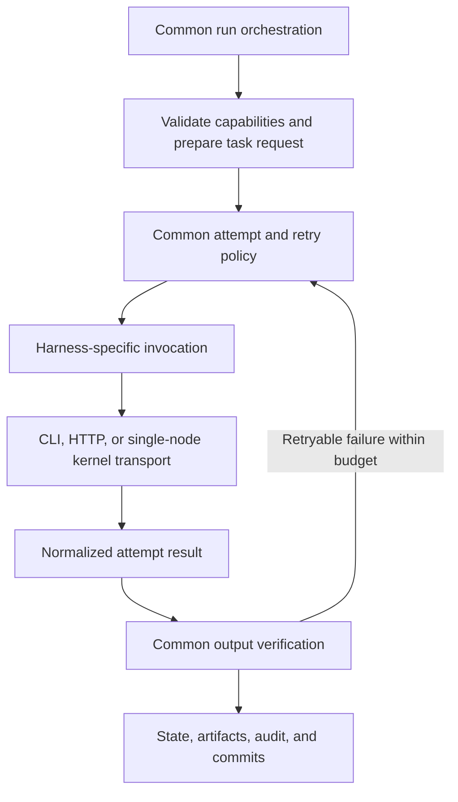

# Codebase Review: Reliability, Reuse, and Maintainability

Date: 2026-09-05  
Status: Historical baseline; remediation completed in the September 2026 modernization work
Environment: Windows with PowerShell

## Executive Summary

The highest-value cleanup work is to clarify state ownership and consolidate duplicated infrastructure. Cosmetic changes or a broad rewrite would not address the most consequential risks.

The review identified ten actionable findings and structural concerns around launcher sessions and adapter boundaries. Priorities are:

1. Make test discovery reliable so a successful test command means tests actually ran.
2. Preserve completed task state across interruptions and prevent missing agents from producing false success.
3. Consolidate harness discovery, frontmatter parsing, process lifecycle management, and incremental log reading.
4. Make workforce skill packages self-contained and launcher sessions independently reusable.
5. Establish a consistent task-execution contract so harness selection changes transport and capabilities, not common workflow policy.

## Scope and Evidence

The review focused on these runtime packages and their nearby tests:

- [Launcher and Console](../scripts/forge-launcher/scripts/launcher.ts): orchestration, background jobs, subprocess handling, and log streaming.
- [Workflow engine](../templates/skills/forge-workflow-engine/scripts/engine.ts): scheduling, persistence, recovery, ownership, and completion semantics.
- [Execution adapter](../templates/skills/forge-execution-adapter/scripts/compiler.ts): manifest compilation and repository discovery.
- [Workforce compiler](../templates/skills/forge-workforce-compiler/scripts/compiler.ts): discovery, packaging, and validation.

This was a targeted review of the primary runtime paths, not an exhaustive audit of every template, UI interaction, security boundary, or external harness. Findings supported by code inspection are distinguished from results observed through execution. External model services were not exercised end to end.

P1 means a high-priority correctness or verification risk. P2 means an important reliability or maintainability issue. Numbered source links refer to the implementation inspected during the review and may move as remediation proceeds.

## Findings

### CR-01: Completed Work Can Disappear from Persisted State

Priority: P1  
Evidence: Code-path inspection; the interruption scenario was not reproduced in a dedicated test.

**Sources:** [Wave execution and merge](../templates/skills/forge-workflow-engine/scripts/engine.ts#L621), [per-task persistence](../templates/skills/forge-workflow-engine/scripts/engine.ts#L338), and [existing different-owner execution test](../templates/skills/forge-workflow-engine/scripts/engine.test.ts#L944).

Every ready task in a wave receives the same pre-wave state. Although execution is currently serialized, the engine waits for the whole wave before merging individual task results. Each task independently persists its running state using that original snapshot.

Failure scenario:

1. Two independent tasks with different owners enter the same wave.
2. Task A completes and returns an updated state, but that result has not yet been merged or persisted.
3. Task B starts and saves a snapshot in which A is still pending.
4. The process exits unexpectedly while B is running.
5. On restart, A can run again despite its completed work and audit event.

The same boundary delays durable completion visibility while later tasks run. Serialization alone does not make state transitions durable.

**Recommendation:** Merge and persist each task transition before starting the next task. If parallel execution is restored later, centralize state updates rather than allowing workers to overwrite whole snapshots derived from stale state.

**Acceptance tests:** Gate B after A completes, inspect persisted state, then simulate recovery. A must remain complete and must not be invoked again. Repeat with B throwing before the wave finishes.

### CR-02: Missing Agents Can Produce False Workflow Success

Priority: P1  
Evidence: Code-path inspection.

**Sources:** [Missing-owner handling](../templates/skills/forge-workflow-engine/scripts/engine.ts#L272), [completion semantics](../templates/skills/forge-workflow-engine/scripts/engine.ts#L80), and [agent discovery during execution](../templates/skills/forge-workflow-engine/scripts/engine.ts#L564).

An unresolved owner causes a task to be skipped. Skipped tasks satisfy dependency checks and count toward workflow completion. Agent discovery errors are caught, leaving execution able to continue without a discovered team.

A missing agent file, stale owner name, or failed discovery can therefore leave required work undone while downstream tasks become eligible and the workflow ultimately reports completion. The defect is the combination of automatic skipping and successful completion semantics, not the existence of a skipped status itself.

**Recommendation:** Validate required owners before execution and block unresolved tasks with actionable diagnostics. Reserve dependency-satisfying skips for explicit, intentional exclusions with a recorded reason.

**Acceptance tests:** A missing owner and a discovery failure must not yield a complete workflow or release dependent tasks. Separately test intentional skips so their supported behavior is preserved.

### CR-03: Standard Engine Test Discovery Can Silently Run Zero Tests

Priority: P1  
Evidence: Observed during execution on Windows.

**Sources:** [Engine test script](../templates/skills/forge-workflow-engine/package.json#L8) and [engine tests](../templates/skills/forge-workflow-engine/scripts/engine.test.ts).

The standard script uses `node --import tsx --test 'scripts/**/*.test.ts'`. In the reviewed Windows environment, `npm test` reported zero tests rather than executing the suite. Explicit enumeration of test files ran 105 tests, including two failures.

This is a false-green verification path. A refactor can appear validated while none of the engine's regression tests have run.

**Recommendation:** Use cross-platform test discovery and make zero discovered tests a failure. Exercise the same supported test entry point on Windows and a Unix-like CI runner.

**Acceptance tests:** A clean supported installation must discover the expected test files through `npm test`. An intentionally empty discovery result must fail. Keep the test-file discovery check separate from individual test assertions.

### CR-04: Duplicated Discovery and Parsing Policies Have Diverged

Priority: P2  
Evidence: Direct comparison of implementations and existing regression coverage.

**Sources:** [Execution-adapter harness selection](../templates/skills/forge-execution-adapter/scripts/discovery.ts#L29), [workforce harness selection](../templates/skills/forge-workforce-compiler/scripts/discovery.ts#L114), [workforce frontmatter parser](../templates/skills/forge-workforce-compiler/scripts/discovery.ts#L12), and [adapter discovery tests](../templates/skills/forge-execution-adapter/scripts/adapter.test.ts#L90).

The execution adapter prefers roots containing agents over skills-only roots. The workforce compiler chooses the first root containing either skills or agents. A skills-only `.agents` directory can consequently hide a valid `.opencode/agents` team in workforce compilation, even though execution-adapter discovery selects the team correctly.

Frontmatter parsing is also duplicated: the adapter uses `gray-matter`, while the workforce compiler uses a handwritten parser. This creates multiple definitions of accepted metadata syntax and normalization behavior.

**Recommendation:** Share harness-selection policy and a structured frontmatter parser. Preserve package-specific result types where they represent genuinely different needs; avoid forcing every consumer to depend on one oversized repository model. Account for bootstrap distribution so shared code is available in target repositories.

**Acceptance tests:** Run the same discovery cases against both consumers: mixed harness roots, skills-only roots, valid quoted and block-scalar YAML, and invalid frontmatter diagnostics.

### CR-05: Workforce Packages Omit Skill Dependencies

Priority: P2  
Evidence: Packaging implementation and fixture inspection.

**Sources:** [Skill export loop](../templates/skills/forge-workforce-compiler/scripts/compiler.ts#L175) and [compiler fixture](../templates/skills/forge-workforce-compiler/scripts/compiler.test.ts#L11).

The compiler exports only each skill's entry document. Supporting scripts, assets, reference documents, and package configuration are not copied. Skills whose instructions refer to those files become incomplete when moved into the workforce package.

The existing package test uses a document-only skill, so its successful validation does not establish that executable or reference-dependent skills are portable.

**Recommendation:** Define and implement a skill packaging policy that includes required directory contents, preserves relative paths, and excludes generated output, installed dependencies, repository metadata, and unrelated local files. Validate supporting-file availability, not just the entry document.

**Acceptance tests:** Package a fixture with a script, a nested reference, and package configuration; verify they are usable from the exported location. Verify exclusions such as `node_modules` and `dist` remain effective.

### CR-06: Detached-Process Helpers Leak Parent File Descriptors

Priority: P2  
Evidence: Code-path inspection; descriptor exhaustion was not load-tested.

**Sources:** [Console spawner](../scripts/forge-launcher/scripts/console/control.ts#L43) and [launcher detached spawner](../scripts/forge-launcher/scripts/format.ts#L227).

Both helpers open log file descriptors and pass them to child processes without closing the parent's copies. Calling `unref()` does not close these descriptors. The Console is long-lived, so repeated background jobs accumulate open descriptors until the parent exits.

The helpers also have different failure behavior: the Console suppresses spawn errors, while the launcher attempts to log them. This is duplicated lifecycle logic with inconsistent operational diagnostics.

**Recommendation:** Consolidate detached spawning behind a small lifecycle-aware API. Track and close each unique parent descriptor in `finally`, including partial-open and spawn-failure paths. Report startup failures to job tracking instead of presenting them as successful launches.

**Acceptance tests:** Verify balanced opens and closes for shared and separate logs, failure to open the second file, spawn errors, and repeated launches. Ensure the child can continue writing after the parent closes its own copies.

### CR-07: Incremental Log Reading Loses Partial Structured Events

Priority: P2  
Evidence: Code-path inspection; split-write behavior was not reproduced through the browser.

**Source:** [Console log and audit tailing](../scripts/forge-launcher/scripts/console/server.ts#L247).

The reader advances its offset to the current file size and returns an incomplete trailing line. Audit and authoring-event consumers discard malformed JSON. If a record arrives in two writes spanning separate polls, neither fragment is reconstructed into the original record, so the structured event is lost permanently.

The reader also ignores the byte count returned by `readSync`, does not retain decoder state across reads, and does not guarantee descriptor closure if a read throws. Errors outside the guarded `statSync` call can escape the polling callback.

**Recommendation:** Extract an incremental reader that retains incomplete records, respects bytes actually read, preserves UTF-8 decoder state, handles truncation or replacement, and closes descriptors reliably. Define separately whether ordinary text logs may emit partial lines.

**Acceptance tests:** Split a JSON record across polls, split a multibyte character, truncate or replace the file, and simulate an open/read error. Each complete structured record must be emitted exactly once without crashing the poller.

## Structural Concern: Launcher Session Ownership

Priority: P2 maintainability concern, not a demonstrated concurrent execution defect.

**Sources:** [Module-level launcher state](../scripts/forge-launcher/scripts/launcher.ts#L76), [stop flag](../scripts/forge-launcher/scripts/launcher.ts#L600), and [launcher entry point](../scripts/forge-launcher/scripts/launcher.ts#L2216).

The roughly 2,250-line launcher combines interactive prompting, authoring, Git operations, configuration, and engine startup. It uses a module-level mutable session and prompt configuration. The main entry point resets the stop flag but does not construct a fresh session object.

This makes independent reuse and isolated testing difficult. Repeated in-process calls must reason about values left by prior calls; dependencies and state are implicit rather than visible in function contracts. This is not an asynchronous memory-visibility race in JavaScript.

**Recommendation:** Create fresh session state per invocation and separate orchestration from terminal interaction and process execution. Extract responsibilities incrementally around tested workflows, rather than splitting files solely by line count. Move generic subprocess command construction out of the orchestration module so the Console does not need that dependency for a utility.

**Acceptance tests:** Execute two sessions in the same process with different repositories and configuration. Verify that repository paths, flags, and environment-derived defaults do not leak between sessions. Test orchestration using injected prompt and command dependencies.

## Adapter Architecture Assessment

### Verdict

The architecture has the right central orchestration shape, but the adapter boundary is not yet sufficient to guarantee consistent behavior across harnesses. The common engine invokes adapters at the task-attempt boundary; however, adapters still decide some common request semantics, and not every implementation represents the same unit or capability of execution.

The goal should not be to move every harness-related operation into `invoke`. Harness-specific initialization, capability checks, and cleanup belong behind the same integration boundary but have different lifetimes. Common orchestration should decide when those operations occur, without implementing each harness's protocol.

### Existing Strengths

**Sources:** [Common task executor](../templates/skills/forge-workflow-engine/scripts/engine.ts#L255), [adapter contract](../templates/skills/forge-workflow-engine/scripts/types.ts#L70), and [adapter selection](../templates/skills/forge-workflow-engine/scripts/cli.ts#L140).

- The engine owns task readiness, owner selection, projected artifact context, retry sequencing, heartbeat reporting, final output verification, state transitions, audit records, and commits.
- Adapters normally return a `TaskResult`; they do not directly decide that the workflow is complete or write the engine's task state.
- The engine computes the effective timeout. Process termination for CLI tools and HTTP cancellation for API calls are appropriately transport-specific implementations of that policy. There is no engine-side watchdog around `invoke`; enforcement currently depends on the implementation honoring the timeout.
- Copilot's `/agent` directive, OpenCode's `--agent`, `--dir`, and `--attach` flags, provider-prefix handling, and HTTP request serialization are legitimate adapter responsibilities.
- Adapter-reported output paths remain advisory: the engine applies the authoritative output gate. Repeated existence checks are not, by themselves, evidence of competing completion policies.

### CR-08: Kernel Adapter Does Not Establish a Single-Task Execution Boundary

Priority: P1  
Evidence: Local command construction and compiler inspection; external kernel execution was not tested.

**Sources:** [Kernel invocation](../templates/skills/forge-workflow-engine/scripts/harness/flowforge-kernel-adapter.ts#L39), [kernel command construction](../templates/skills/forge-workflow-engine/scripts/harness/flowforge-kernel-adapter.ts#L112), and [compiled workflow construction](../templates/skills/forge-workforce-compiler/scripts/compiler.ts#L45).

The engine calls `invoke` once per task attempt. The kernel adapter's default command is `flowforge run <workforce> <workflowId>`, while the compiler builds that workflow from all manifest tasks. The command supplies no task-node selector. Task identity is supplied through environment variables, but this repository does not establish that the external kernel uses those variables to restrict execution to that task. A custom argument template can include a task ID, but that is optional configuration rather than a guaranteed contract.

Consequently, the default bridge risks invoking a whole workflow for each engine task, with two layers potentially responsible for scheduling and retries. This is a contract mismatch visible locally; repeated external execution is a risk to verify, not a reproduced result.

The adapter also explicitly ignores `contextBlock`, so the engine's projected artifact context is not forwarded through this invocation path. Package-provided context is not evidence that the task-specific projection was preserved.

**Recommendation:** Choose one orchestration owner. Either expose a kernel operation that executes exactly one task/node and receives the normalized task context, or treat the kernel as a whole-workflow backend outside the engine's per-task loop. Do not present whole-workflow delegation as interchangeable with a single-attempt task adapter.

**Acceptance tests:** For a two-task manifest, prove that invoking task A cannot execute B. Verify context reaches the selected task and retries do not restart unrelated nodes. If whole-workflow delegation is chosen, verify only one workflow submission and explicit reconciliation of returned task results.

### CR-09: Common Request Semantics Are Reimplemented by Each Adapter

Priority: P2  
Evidence: Direct comparison of the CLI and API adapter implementations.

**Sources:** [Copilot model selection and invocation](../templates/skills/forge-workflow-engine/scripts/harness/copilot-adapter.ts#L42), [OpenCode model selection and invocation](../templates/skills/forge-workflow-engine/scripts/harness/opencode-adapter.ts#L55), and [OpenAI model selection and invocation](../templates/skills/forge-workflow-engine/scripts/harness/openai-adapter.ts#L28).

Copilot and OpenCode select `task.model ?? agent.model`. OpenAI selects `agent.model ?? defaultModel`, silently ignoring the task-level override. That is common selection policy drifting between adapters, unlike provider-prefix formatting, which legitimately depends on the harness.

The two CLI adapters also duplicate the task body, expected-output instructions, validation hints, execution-budget hints, and directive to perform the task. OpenAI builds a separate user prompt without the timeout/retry hints. Equivalent requests can therefore convey different common instructions before any necessary transport-specific formatting occurs. Different message layouts are valid; differing task policy should be intentional and tested.

**Recommendation:** Resolve common model precedence and construct a normalized task request once. Build common task instructions from that request, then let the adapter wrap them as a CLI prompt, system/user messages, or structured kernel payload. Retain native persona selection and model-ID conversion inside the adapter. If fallback models are supported, define fallback selection centrally rather than allowing independent adapter retry loops.

**Acceptance tests:** Apply one conformance fixture to every adapter: task-model override, agent-model fallback, explicit context, expected outputs, validation instructions, and execution budget. Assert semantic preservation, not identical wire-format strings. Keep separate tests for provider-qualified OpenCode IDs and Copilot's model-ID conversion.

### CR-10: Adapter Capabilities Do Not Describe Whether a Task Can Be Executed

Priority: P2  
Evidence: Contract and OpenAI implementation inspection; no live API calls were made.

**Sources:** [HarnessAdapter capabilities](../templates/skills/forge-workflow-engine/scripts/types.ts#L70) and [OpenAI request/result handling](../templates/skills/forge-workflow-engine/scripts/harness/openai-adapter.ts#L28).

The interface exposes `supportsConcurrency`, but no distinction between a text-response provider, a repository-editing agent, and a whole-workflow executor. OpenAI ignores the repository root, sends only chat messages, provides no tool definitions or tool-execution loop, and returns text with an empty output-file list.

It is therefore not an equivalent repository-editing harness. The engine can discover this only after an attempt through output verification: missing declared outputs fail, while substantive text may be acceptable for tasks without declared files. A text-only task is legitimate; accepting a file-editing task without checking executor capability is the gap. Shared prompting alone cannot grant filesystem tools to a plain chat request.

**Recommendation:** Describe capabilities needed for routing, such as task versus workflow execution and text-only versus repository-tool execution. Match them against explicit task requirements before invocation. Either provide an actual tool-execution integration for OpenAI or expose it as a text-only executor with a clear supported task class. Capabilities should represent real differences, not become a large set of incidental flags.

**Acceptance tests:** A task requiring repository edits must be rejected before a text-only API call is made. A text task must remain supported. Every supported executor must still pass through the same engine verification policy after its result is returned.

### Remaining Boundary Concerns

- **Oversized input contract:** `invoke` receives the entire mutable `WorkflowState`, even though the real adapters inspected ignore it and the engine already supplies projected context. Prefer a read-only request containing the task, resolved persona/model, projection, repository location, attempt metadata, and budget. This reduces accidental coupling to scheduling and persistence internals.
- **Lifecycle placement:** [CLI run setup](../templates/skills/forge-workflow-engine/scripts/cli.ts#L275) knows about OpenCode attach-server startup and teardown, while the kernel adapter performs package preflight inside invocation. Wiring implementations in the composition root is appropriate, but run-scoped lifecycle operations should have a consistent ownership and cleanup contract. Do not move generic scheduling into adapters merely to hide a harness-name switch.
- **Failure contract:** The [engine invocation boundary](../templates/skills/forge-workflow-engine/scripts/engine.ts#L380) clears its heartbeat in `finally` but does not normalize a rejected adapter promise into the returned-failure retry path. Define which failures return results, which are terminal configuration errors, and how unexpected exceptions are recorded and cleaned up. Avoid retrying every exception indiscriminately.
- **Authoring integration:** The launcher's [headless skill runner](../scripts/forge-launcher/scripts/launcher.ts#L459) is another harness command-construction path. Authoring and build execution may have different workflows, but should reuse transport-level command and error handling where semantics match. Do not force authoring through build-task scheduling merely to reuse the adapter class.
- **Capability documentation:** `supportsConcurrency` describes behavior that the engine currently overrides by serializing output attribution. Clarify that transport concurrency support does not imply repository-level isolation or permission for the scheduler to parallelize tasks.

### Recommended Ownership Model

| Responsibility | Owner | Adapter involvement |
| --- | --- | --- |
| Dependency ordering, task selection, retries, completion | Common engine | None |
| Model precedence, attempt budget, task instructions, artifact projection | Common request preparation | Consume resolved request; do not reinterpret policy |
| Capability matching and run lifecycle ordering | Common orchestration | Declare capabilities; implement harness-specific preflight and cleanup |
| Native persona selection, model-ID syntax, CLI/API/kernel protocol | Harness adapter | Implement only the required translation |
| Spawn/HTTP mechanics, bounded output, cancellation primitives | Shared transport helpers where applicable | Select and configure the appropriate transport |
| Result decoding and harness-specific diagnostics | Harness adapter | Return a normalized attempt result |
| Output attribution, validation gates, state, audit, commits | Common engine | Report evidence, not authoritative completion |
| Whole-workflow delegation | Separate workflow-backend contract | Do not masquerade as single-task invocation |

This is a proposed ownership model, not a claim that new interfaces or lifecycle methods already exist. Initialization and cleanup surround the run; the diagram shows the task-attempt path only.

### Architecture Acceptance Criteria

1. Adding a task harness requires an implementation and composition-root registration, not changes to scheduling, retry rules, verification, or persistence.
2. One task-adapter invocation means one task attempt; whole-workflow backends use a different contract.
3. A shared request fixture preserves common model precedence, context, instructions, and budget through every supported adapter.
4. No unsupported task reaches the transport, and no adapter can bypass the common output gate by returning success.
5. Returned failures, rejected promises, timeouts, and cancellation exercise documented common outcomes; transport cleanup remains correct on every path.
6. Harness-specific initialization is scoped to the run or session, and cleanup is guaranteed even when execution fails. Task invocation does not repeatedly perform unrelated project setup.
7. Tests distinguish transport capability from repository isolation, and adding shared code does not break bootstrapped skill distribution.

## Verification Results

These results were captured during the preceding code review. They are a baseline, not a claim that all findings have been reproduced or fixed. The adapter architecture extension is based on source inspection; it did not rerun these suites or exercise live API/kernel integrations.

| Package | Test result | Typecheck |
| --- | --- | --- |
| Launcher | 110 tests: 108 passed, 2 failed | Passed |
| Workflow engine, standard command | 0 tests discovered | Passed |
| Workflow engine, explicit file enumeration | 105 tests: 103 passed, 2 failed | Same package typecheck passed |
| Execution adapter | 22 tests: 21 passed, 1 failed | Passed |
| Workforce compiler | Test loading blocked by missing `tsx` | Blocked by missing `tsc` |

Failure details retained from the review:

- Execution adapter: `discoverForgeRepo detects the decomposed feature layout` failed on `repo.visionPath.endsWith("docs/product-vision.md")`. This assertion is Windows-sensitive because native separators differ.
- Workflow engine: `output gate: a passing manifest validation command allows completion` expected `complete` but received `failed`.
- Workflow engine: `runTaskValidation requires every command to pass` expected `true` but received `false`. The underlying command failures need diagnosis; this review did not establish their root cause.
- Launcher: two assertion failures were observed. Their individual names and complete diagnostics were not retained; rerun and capture them before remediation.
- Workforce compiler: missing development dependencies prevented local verification. This is an environment limitation, not proof that its source or tests are defective.

The review did not install missing dependencies or change implementation files. The
review remains the historical baseline; subsequent modernization work addressed
its actionable launcher, authoring, adapter, lifecycle, template, and Console
findings without rewriting the original evidence or platform caveats.

## Remediation Sequence

1. **Restore trustworthy verification:** fix CR-03, capture all baseline failures, and establish supported-platform test commands.
2. **Protect execution correctness:** fix CR-01 and CR-02 with interruption and ownership regression tests.
	Resolve CR-08 before relying on the kernel adapter for per-task execution.
3. **Repair shared infrastructure:** address CR-04, CR-06, and CR-07 through narrowly scoped modules with consumer-level contract tests.
4. **Restore packaging completeness:** address CR-05 and test exported skills outside their source directories.
5. **Improve orchestration reuse:** introduce per-invocation launcher sessions and extract tested responsibilities incrementally.
6. **Enforce adapter consistency:** address CR-09 and CR-10 through normalized requests, capability checks, and a shared conformance suite; then regularize lifecycle and failure handling.

Avoid introducing a large generic utility package or coupling independently distributed skills through unavailable source paths. Share stable policies and lifecycle operations, and verify that bootstrap and package distribution preserve those dependencies.

## Interpretation Boundaries

- Serialized engine execution is an intentional safeguard for repository-wide output attribution. Simply restoring configured concurrency is not a safe fix for CR-01.
- A smaller TypeScript interface does not discard additional JSON properties at runtime. Interface differences alone are not evidence of runtime data loss.
- The findings do not justify deleting historical artifacts without a retention and lineage policy.
- A passing typecheck does not establish runtime contract validity, complete test discovery, or correctness under interrupted execution.