# Forge Console - Visual Tour

A screenshot walkthrough of the Forge Console. These images were captured from
the current Console build in Chrome against a deterministic local fixture;
no external authoring or paid model execution was used. Desktop captures use
the stable numbered filenames below. The complete desktop and responsive
capture set is archived under `images/forge-console/current/`. Start with
`forge-launcher console`.

> See [forge-console.md](forge-console.md) for the full reference.

---

## 1. Home

The landing page. Two action cards - **Create a new project** (→ `#/new`) and
**Open an existing project** (→ `#/projects`) - plus a **Recent projects**
dropdown for one-click return to a prior project.

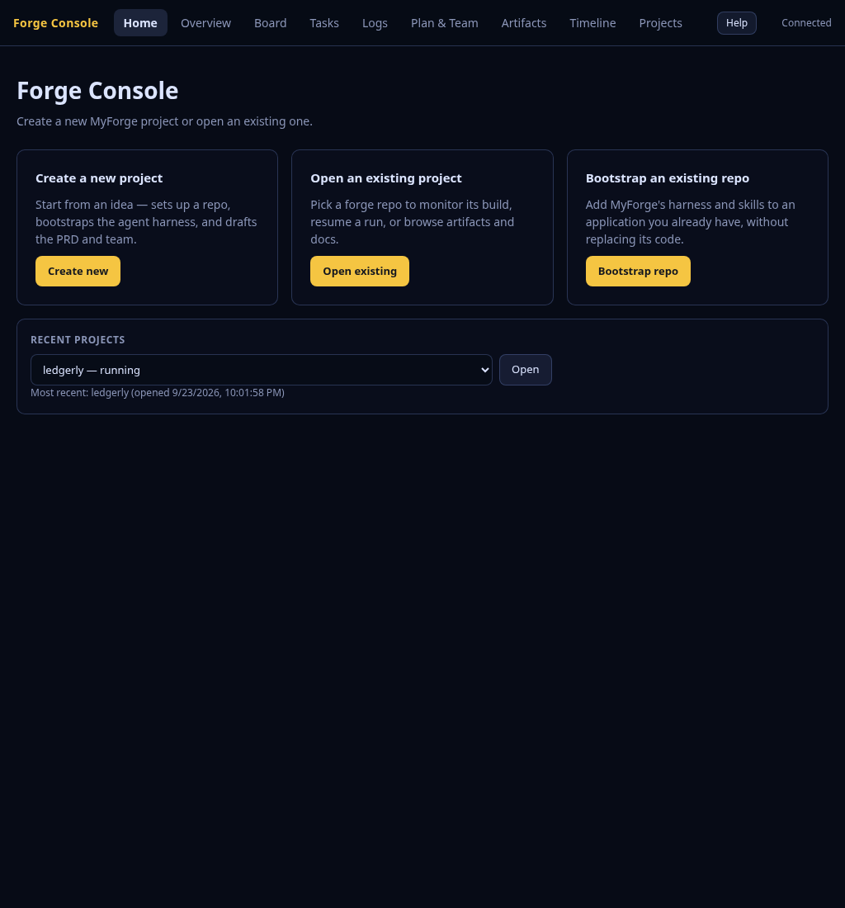

## 2. Overview

The dashboard puts project identity, the next pipeline action, and blockers
first. PRD, team, and project-skill authoring have separate status and model
summaries. Authoring retries are distinct from native execution controls;
legacy projects do not need to regenerate a team just to resume a build.

## 3. Board

The PixiJS **Forge Board**, embedded full-screen: tasks as name-tag cards flowing
through **To Do · In Progress · Done · Failed**, grouped by phase.

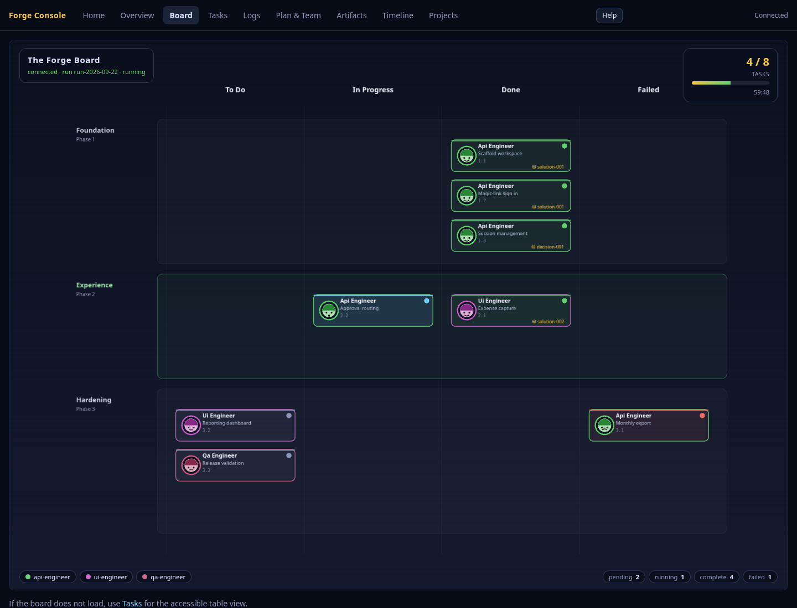

## 4. Tasks

Every task appears in a sortable, filterable table with status chips, search,
and explicit manual selection. Selections and focused controls survive live
updates. On narrow screens, the labelled table region scrolls horizontally
instead of widening the whole page.

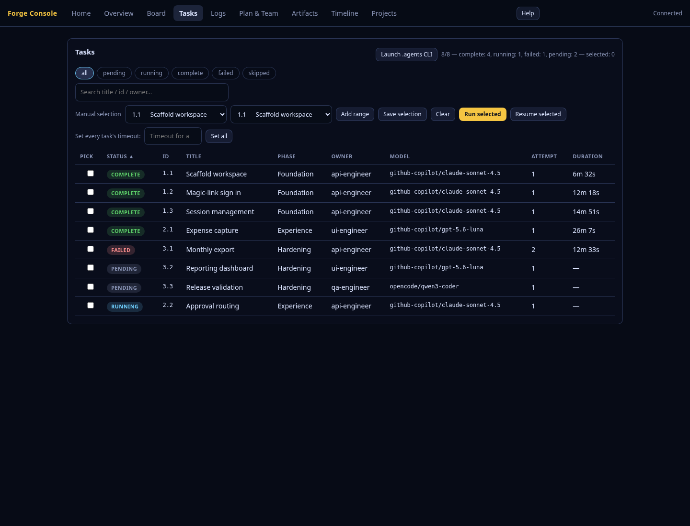

## 5. Task detail

Clicking a row expands a detail drawer: description, expected outputs, validation
commands, dependencies, inputs, output files, and error/artifact metadata.

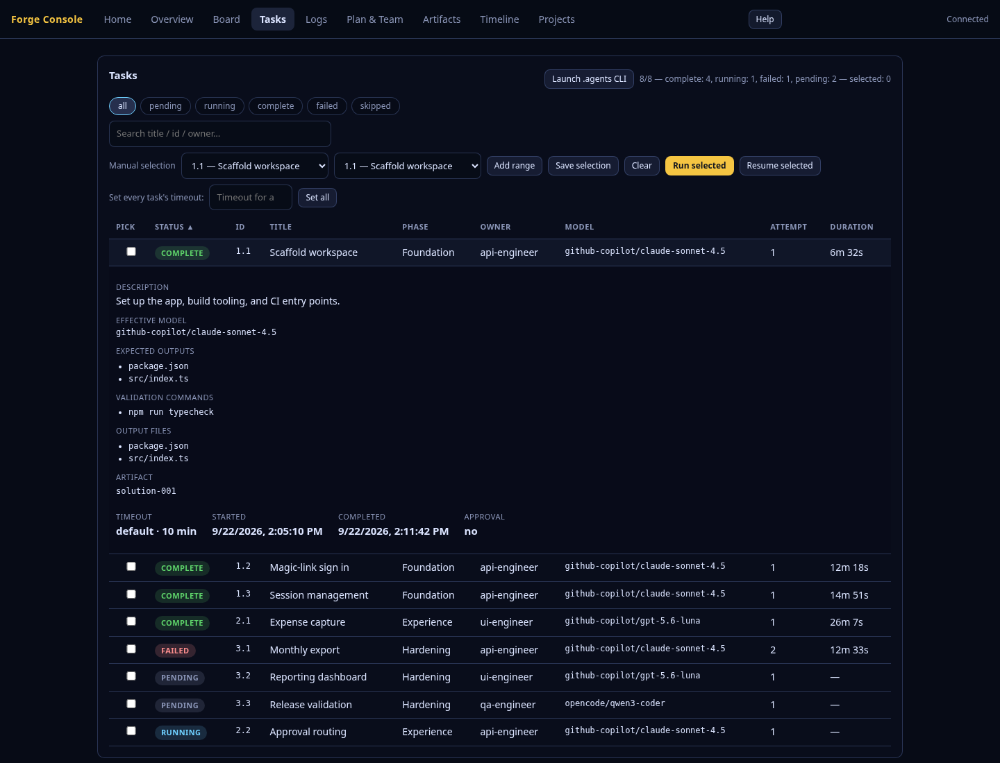

## 6. Logs (engine)

The `docs/engine-run.log` tail, live-appended over SSE. Follow mode keeps new
output in view; disabling it preserves the reading position and shows unread
output.

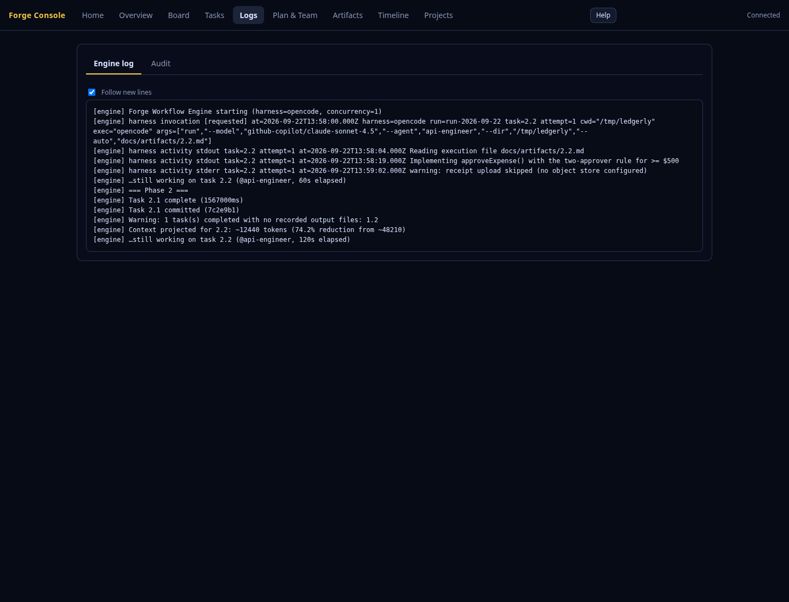

## 7. Logs (audit)

The audit event stream (run/phase/task lifecycle), also live.

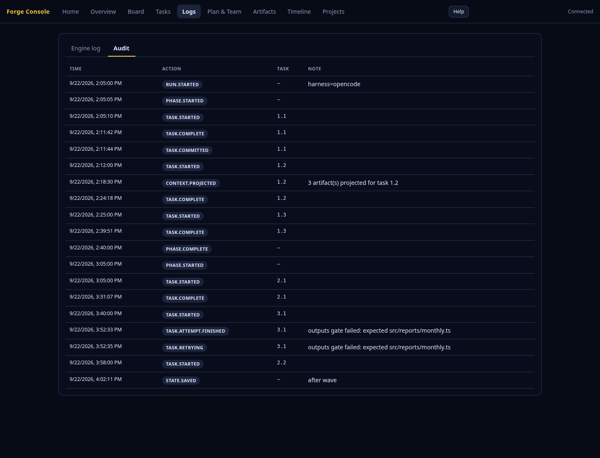

## 8. Plan & Team

Independent PRD, team, and project-skill **Authoring models** are available
before a team exists. Save a model or leave a stage on **Inherit runner default**.
Inventory refresh and unavailable saved selections remain explicit. The
**Documents**, **Agents**, and **Skills** sections keep execution-model
overrides separate from authoring settings.

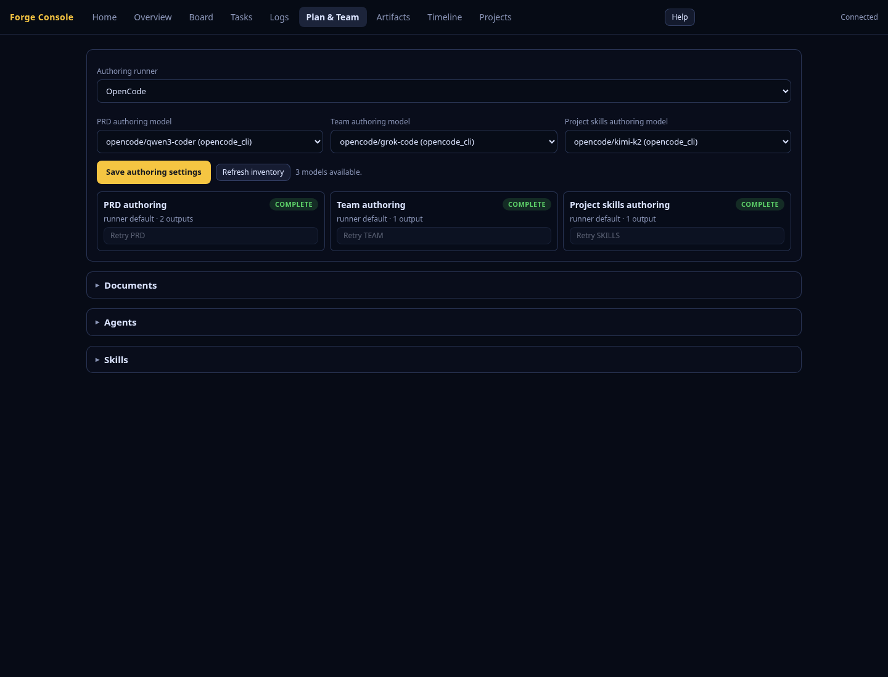

## 9. Plan & Team - a document

Expanding **Documents** and selecting the PRD renders it as Markdown, with an
**Open externally** button to edit it in your editor.

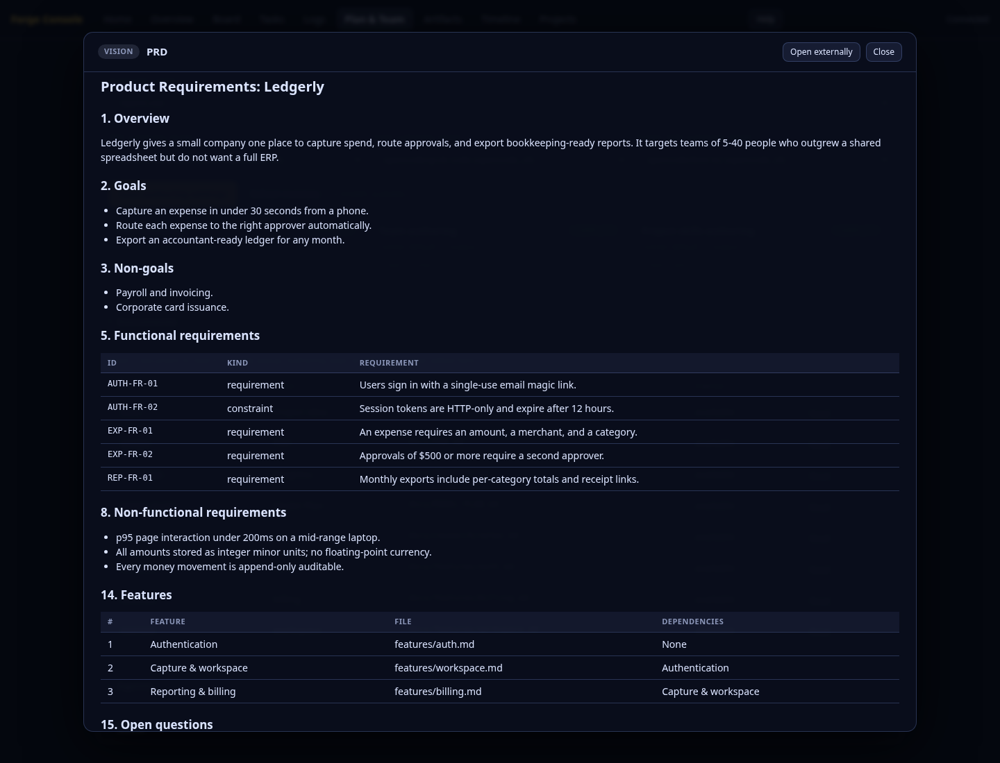

## 10. Artifacts

The structured outputs each task produced, browsable by type.

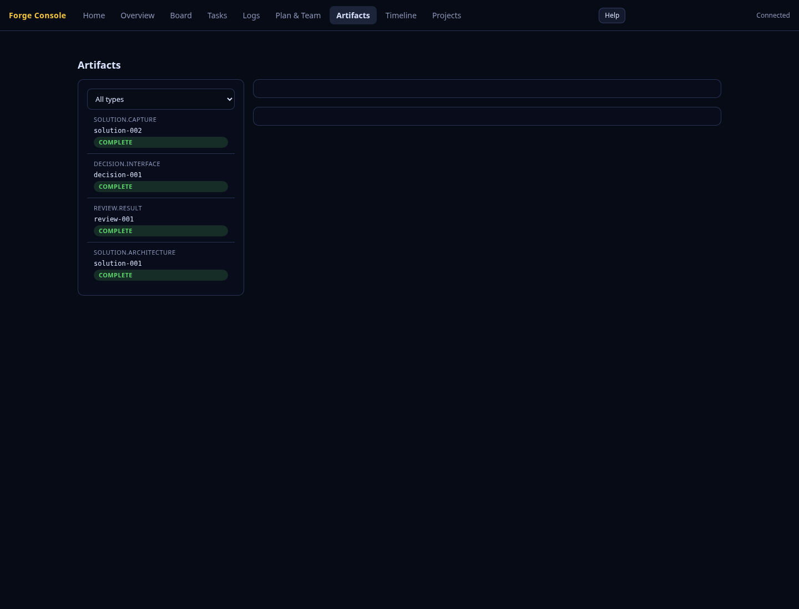

## 11. Artifact detail

Selecting an artifact shows its metadata, payload, and changed files.

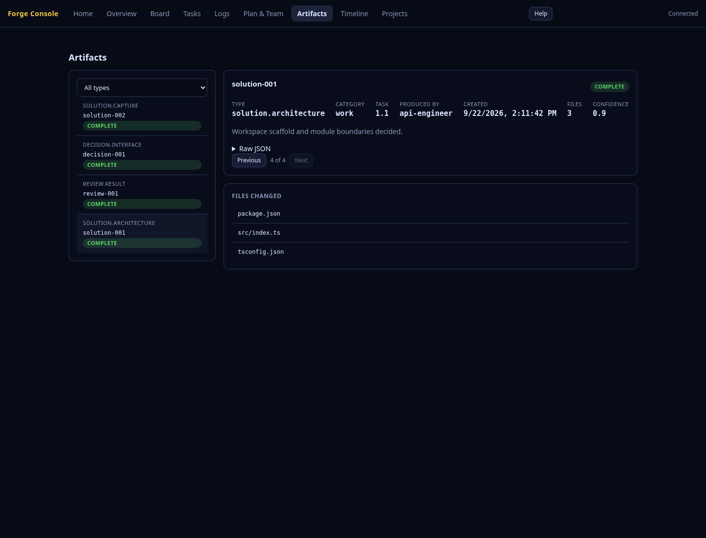

## 12. Timeline

Chronological audit events, with failures highlighted.

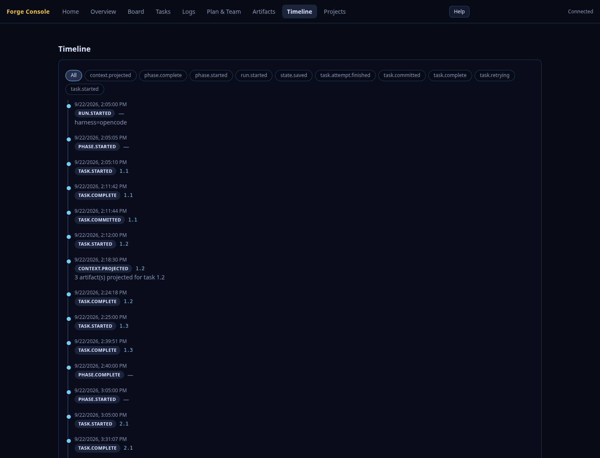

## 13. New project

The **New Project** wizard (`#/new`) collects project details, supported text
documents, three optional authoring model choices, and the auto-draft setting.
Auto-draft runs PRD, team, and project-skill generation as separate stages.
Selecting an existing PRD skips drafting it. Failed uploads or saves keep
the draft available rather than silently starting with missing inputs.

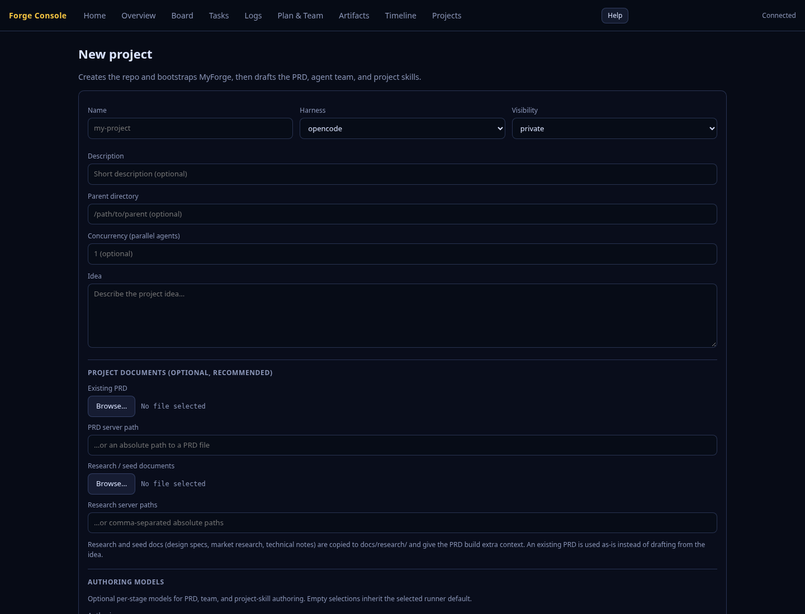

## 14. Help

The **Help** dialog explains the pipeline, views, and key terms. Opening it moves
keyboard focus into the dialog; Escape closes it and returns focus to Help.

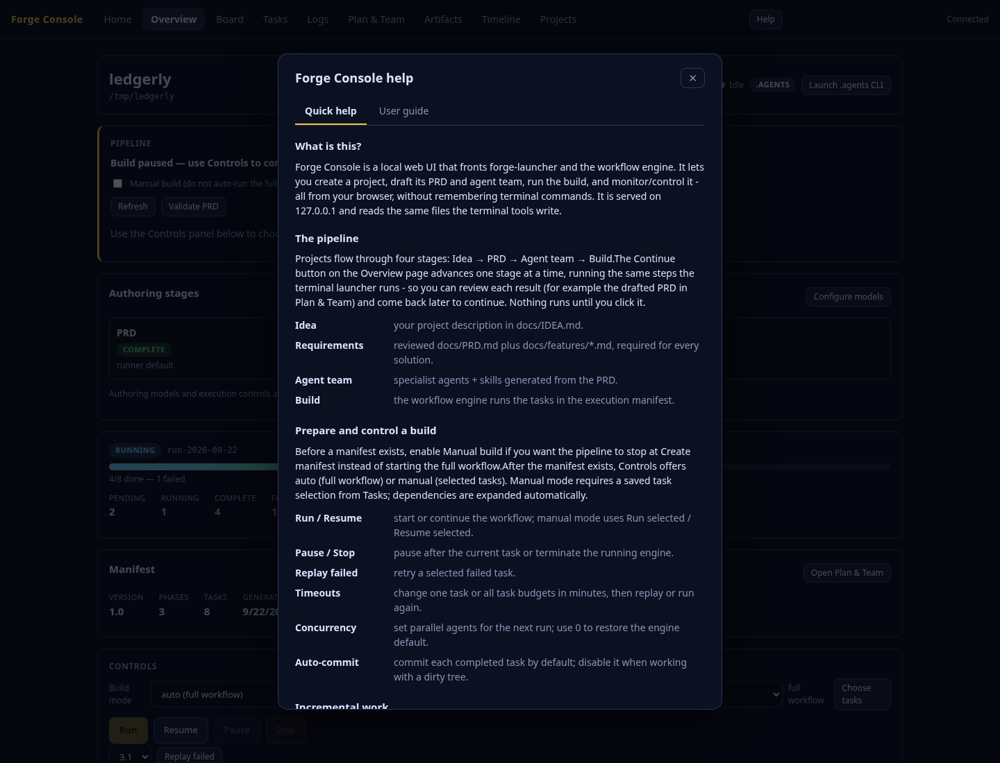

## Responsive current captures

The current build was captured at 1024px, 720px, 390px, and 320px for every
route. Detail-state captures (expanded task, rendered PRD, artifact detail,
and audit log) are also included in `images/forge-console/current/`.

| View | 1024px | 720px | 390px | 320px |
| --- | --- | --- | --- | --- |
| Overview | [image](images/forge-console/current/overview-1024.png) | [image](images/forge-console/current/overview-720.png) | [image](images/forge-console/current/overview-390.png) | [image](images/forge-console/current/overview-320.png) |
| Board | [image](images/forge-console/current/board-1024.png) | [image](images/forge-console/current/board-720.png) | [image](images/forge-console/current/board-390.png) | [image](images/forge-console/current/board-320.png) |
| Tasks | [image](images/forge-console/current/tasks-1024.png) | [image](images/forge-console/current/tasks-720.png) | [image](images/forge-console/current/tasks-390.png) | [image](images/forge-console/current/tasks-320.png) |
| Logs | [image](images/forge-console/current/logs-1024.png) | [image](images/forge-console/current/logs-720.png) | [image](images/forge-console/current/logs-390.png) | [image](images/forge-console/current/logs-320.png) |
| Plan & Team | [image](images/forge-console/current/documents-1024.png) | [image](images/forge-console/current/documents-720.png) | [image](images/forge-console/current/documents-390.png) | [image](images/forge-console/current/documents-320.png) |
| Artifacts | [image](images/forge-console/current/artifacts-1024.png) | [image](images/forge-console/current/artifacts-720.png) | [image](images/forge-console/current/artifacts-390.png) | [image](images/forge-console/current/artifacts-320.png) |
| Timeline | [image](images/forge-console/current/timeline-1024.png) | [image](images/forge-console/current/timeline-720.png) | [image](images/forge-console/current/timeline-390.png) | [image](images/forge-console/current/timeline-320.png) |
| Projects | [image](images/forge-console/current/projects-1024.png) | [image](images/forge-console/current/projects-720.png) | [image](images/forge-console/current/projects-390.png) | [image](images/forge-console/current/projects-320.png) |
| New project | [image](images/forge-console/current/new-1024.png) | [image](images/forge-console/current/new-720.png) | [image](images/forge-console/current/new-390.png) | [image](images/forge-console/current/new-320.png) |
