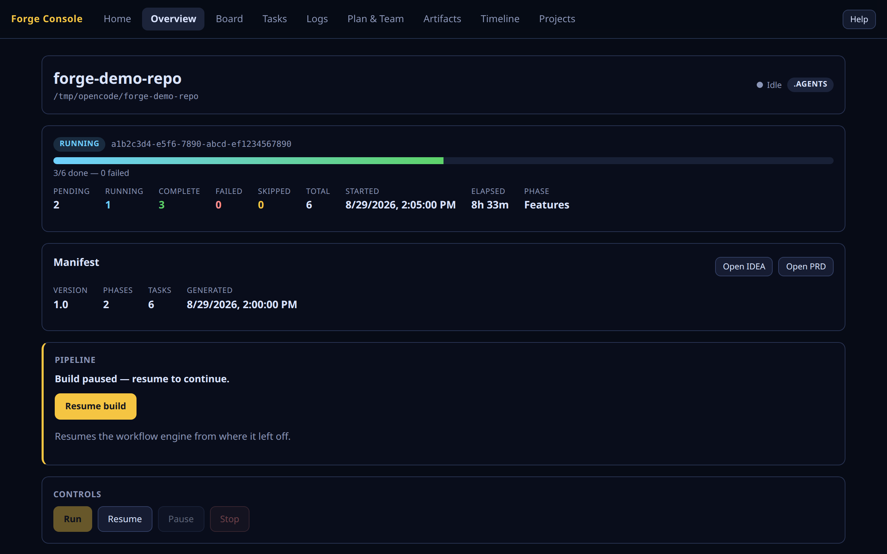

# Forge Console — Visual Tour

A screenshot walkthrough of the Forge Console running against a demo project
(**TaskFlow**, harness `opencode`, a 6-task build with a running task). Start it
with `forge-launcher console`, then follow the views below.

> See [forge-console.md](forge-console.md) for the full reference.

---

## 1. Home

The landing page. Two action cards — **Create a new project** (→ `#/new`) and
**Open an existing project** (→ `#/projects`) — plus a **Recent projects**
dropdown for one-click return to a prior project.

## 2. Overview

The main dashboard: repo header with a live/idle indicator and harness badge,
run status + progress (`3/6 done`), phase, and counts. The **Pipeline** panel
holds the single **Continue** button (here **Resume build**, because the run is
paused-midway), and the **Controls** panel offers Pause / Stop / Resume / Replay.

## 3. Board

The PixiJS **Forge Board**, embedded full-screen: tasks as name-tag cards flowing
through **To Do · In Progress · Done · Failed**, grouped by phase.

## 4. Tasks

Every task in a sortable, filterable table (status, id, title, phase, owner,
attempt, duration), with status-filter chips and a search box.

## 5. Task detail

Clicking a row expands a detail drawer: description, expected outputs, validation
commands, dependencies, inputs, output files, and error/artifact metadata.

## 6. Logs (engine)

The `docs/engine-run.log` tail, live-appended over SSE.

## 7. Logs (audit)

The audit event stream (run/phase/task lifecycle), also live.

## 8. Plan & Team

The project's documents and team in three collapsible sections — **Documents**,
**Agents**, **Skills** (collapsed by default).

## 9. Plan & Team — a document

Expanding **Documents** and selecting the PRD renders it as Markdown, with an
**Open externally** button to edit it in your editor.

## 10. Artifacts

The structured outputs each task produced, browsable by type.

## 11. Artifact detail

Selecting an artifact shows its metadata, payload, and changed files.

## 12. Timeline

Chronological audit events, with failures highlighted.

## 13. New project

The **New Project** wizard (`#/new`): name, harness, visibility, parent
directory, idea, and an auto-draft toggle — spawns `forge-launcher --non-interactive`
in the background.

## 14. Help

The **Help** overlay (top-right button) explains the app, the pipeline, each
view, and key terms.

